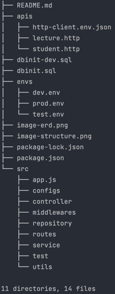
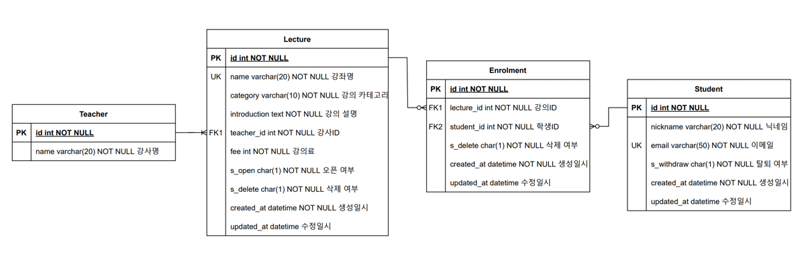
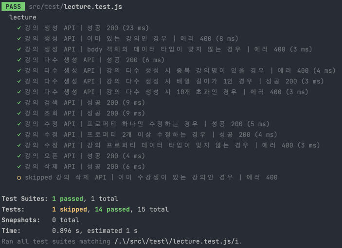
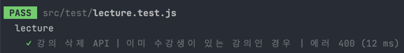
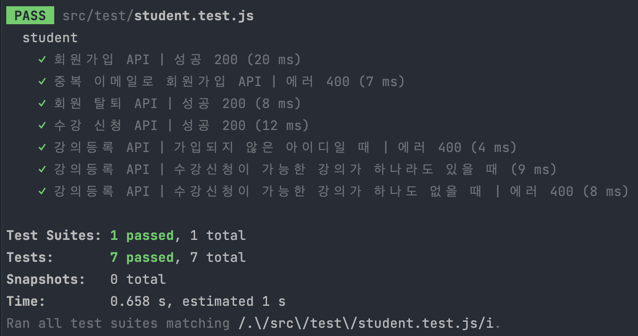

# inflab-pretest
### 프로젝트 실행방법

1. `npm install` 명령어로 프로젝트의 라이브러리들을 설치해줍니다.
2. `./envs/prod.env` 내의 DB 접속 정보를 수정합니다.
3. `npm run start` 명령어로 프로젝트를 실행합니다.
4. 각 API는 `./apis` 디렉토리 내 `.http` 문서를 통해 테스트할 수 있습니다.

디렉토리 구조

- `./apis` 폴더는 env에 따른 다른 host 설정파일과 http 파일들로 구성하였습니다.
- `*.sql` 파일들은 DB 스키마 초기 설정을 위한 파일로 환경에 따라 분기하여 관리될 수 있도록 구성하였습니다.
- `./envs` 폴더는 환경에 따라 변수들을 관리될 수 있도록 분기하여 구성하였습니다. prod / dev / test 실행 환경에 따라 해당 파일이 .env 파일로 되어 작동합니다. 더불어, 공통적으로 사용되는 것들은 `./.env` 에 작성하였습니다.
- `./configs` 폴더는 DB 세팅 및 로깅을 위한 모듈로 구성하였습니다.
- `./routes` 폴더는 해당 폴더 내에 추후 프로젝트의 고도화를 고려하여 버전별로 구분하였습니다. 더불어, route 파일들의 이름을 토대로 uri가 설정될 수 있도록 했습니다.
- `./test` 폴더는 도메인별로 나누어 두 가지 테스트 파일들로 구성되어있습니다.
- `./utils` 폴더는 api response 형식을 통일하기 위한 설정파일으로 구성되어있습니다.

ER 다이어그램

### 구현방법 및 설계방향

- 프로젝트의 설계는 DB에 접근하는 컴포넌트인 repository, 비즈니스 로직인 담당하는 컴포넌트인 service, http 요청과 응답을 담당하는 컴포넌트인 controller, uri를 관리하는 route로 구성하여 MSA 방식으로 설계하였습니다.
- 의존성 주입(DI)은 typeDI 라이브러리를 활용하여 `*.service.js` 파일들을 컨테이너에 등록하여 `*.controller.js` 내에서 주입하여 적용하였습니다.
- DB의 경우, 어떤 환경에서든 실행했을 때 바로 DB에 접근할 수 있도록 `*.sql` 파일들로 서버를 실행하면 스키마가 생성될 수 있도록 구현하였습니다. 또한, DB에 접근하여 데이터를 조작할 때 성공 시 결과값을 반환하고 에러가 났을 경우에는 로그를 남기는 식으로 모듈화하여 DB에 접근하는 모든 부분에서 해당 메서드를 불러와 사용할 수 있도록 구현했습니다.
- route의 경우, `index.js` 파일 내에서 해당 폴더에 있는 모든 `*.route.js` 형식의 이름을 가지고 있는 파일들은 `*` 부분의 `string`으로 시작하는 uri가 자동적으로 설정될 수 있도록 설계하였습니다. 이를 통해, 각 route 파일 내의 겹치는 uri 부분을 정리하여 조금 더 깔끔해진 코드를 구현할 수 있었습니다.
- 각 api 요청 시, 공통된 형식으로 응답할 수 있도록 `apiResponse` 라는 파일 내에 모듈화하여 각 controller 단에서 불러와 사용할 수 있도록 구현하였습니다. 해당 모듈에서는 request, response, response body 및 http 응답코드, error를 파라미터로 보내면 응답이 성공했을 때 및 에러가 났을 때를 구분하여 응답할 수 있도록 구성되어있습니다.
- ES6 문법을 사용하기 위해 babel과 airbnb 프리셋을 사용하였습니다.
- 테스트의 경우, Jest와 Supertest를 활용해 api 테스트 위주로 진행하였고, 각 상황별 및 파일별 테스트는 진행해보았으나 전체 테스트 파일들을 테스트하는 통합테스트는 스크립트로 실행 시 두 파일 실행으로 인한 서버가 연속적으로 실행되고 충돌이 일어나는 이슈로 진행해보지는 못했습니다.
- Watch 도구는 가장 익숙한 nodemon을 사용했습니다.
- 날짜 라이브러리의 경우 현업에서는 dayJS를 사용했지만 향로님의 블로그에서 js-joda를 사용하는 이유에 신선한 자극을 받아 js-joda를 사용했습니다. 저 역시 현업에서 개발하던 도중에, momentJS가 deprecated 되어 대체할만한 라이브러리를 찾아야했는데 dayJS가 점유율이 높고 last published가 가장 최신이었던 점에서 업데이트가 계속될 것이라는 판단하에 dayJS를 사용했었는데 dayJS를 사용하는 이유가 용량이 가볍다는 점이 가장 장점이지만 이는 백엔드에 최적의 선택은 아니다라는 점을 새롭게 알 수 있었습니다. 이번 기회에 새로운 라이브러리를 사용해볼 수 있었습니다.
- Validation 라이브러리의 경우 Joi를 사용하여 강의 등록, 강의 수정, 수강생 회원가입 api의 미들웨어로 활용했습니다.
- Logger 라이브러리의 경우 Winston을 사용하여 에러가 나는 경우에는 error log를, 아닌 경우에는 http 통신 로그를 json 파일 형식으로 매일 적재될 수 있도록 구현하였습니다.
- app.js는 공통 .env 설정을 비롯해 환경별 .env 설정을 할 수 있도록 구현하였습니다. 이를 위해 실행 스크립트는 환경별로 `export=환경` 명령어로 시작합니다. 하지만, 이 방법이 맥과 리눅스 환경에서는 적용이 되지만, 윈도우 환경에서는 적용되지 않는다는 점이 프로젝트의 부족한 점 중 하나라고 생각이 됩니다.

    body-parser를 사용해 json 형식으로 통신할 수 있도록 구현했습니다. route 설정을 import하여 모든 uri에 `/v1`이 붙을 수 있도록 해주었습니다. 마지막으로, 해당 파일을 테스트 파일에서 supertest에 불러와 사용할 수 있도록 export 해주었습니다.
- 강사 테이블을 제외한 모든 테이블에는 삭제여부 컬럼을 통해 실제 데이터베이스에는 데이터가 남아있고, 사용자에게만 보이지 않도록 하였고, 강의 삭제, 강의 조회, 강의 검색, 회원 탈퇴 시 삭제 여부를 조건의 기준 중 하나로 적용될 수 있도록 구현하였습니다.
- 등록 테이블을 스키마에 추가로 구성하여 강의ID 및 학생ID를 외래키로 설정함으로써 카디널리티가 낮을 수 있도록 구현하였습니다.

테스트 결과

#### 강의 관련 API

#### 학생 관련 API

